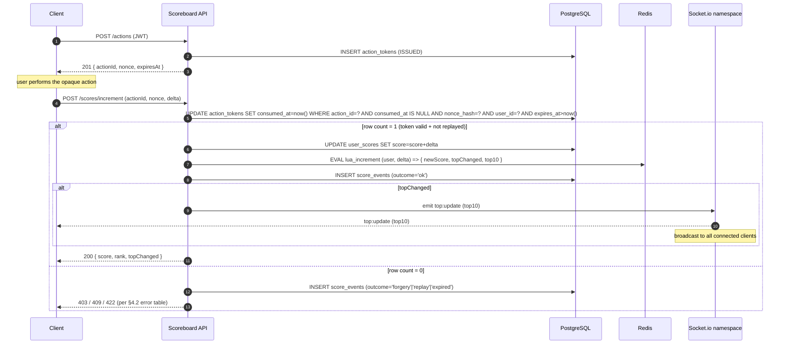
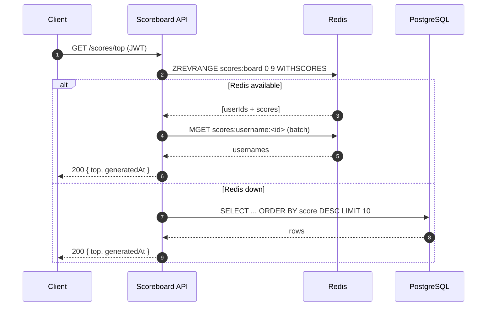
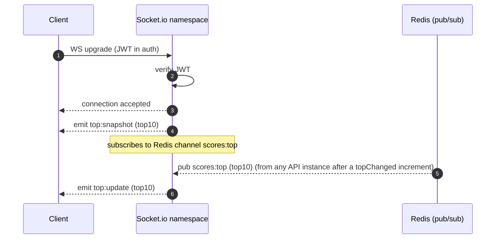
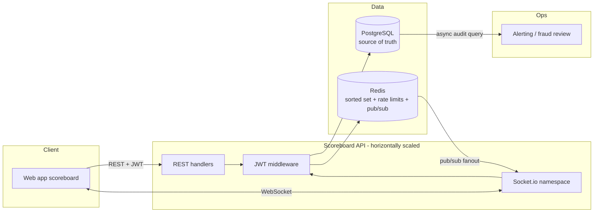

# Problem 6 — Scoreboard Service Specification

> Backend module spec for a live top-10 scoreboard. This document is the
> contract the backend engineering team will implement against.

## 1. Overview

The **Scoreboard Service** is a backend module that:

1. Accepts authenticated requests to increment a user's score after the user
   completes an opaque "action" in the client application.
2. Maintains a **top-10 leaderboard** that any client can read.
3. **Pushes live updates** to connected clients whenever the top 10 changes.
4. Rejects unauthorised or forged score-increment requests, so a malicious
   client cannot inflate its own (or anyone else's) score.

This spec defines the public API, the data model, the execution flow, and
the anti-cheat design. The underlying "action" the user performs is out of
scope — the service treats it as opaque and verifies only that a legitimate
completion happened.

## 2. Scope

### In scope

- REST endpoints for action tokens, score increment, and top-10 reads.
- A real-time channel for broadcasting scoreboard changes.
- Authentication middleware integration (JWT bearer, assumed to already exist
  elsewhere in the platform).
- Anti-cheat primitives: action tokens, rate limiting, audit trail.
- Data model in both the primary store (PostgreSQL) and the hot-path cache
  (Redis sorted set).

### Out of scope

- **User / auth provisioning.** Issuing the JWTs and managing users is
  handled by the platform's existing identity service. This module only
  *validates* bearer tokens.
- **The action itself.** The client may be solving a puzzle, completing a
  level, finishing a quiz — this service does not inspect or re-execute the
  action. It verifies that a completion is accompanied by a valid,
  server-issued, single-use action token.
- **Historical analytics.** Beyond a simple audit table, long-term score
  history / ranking charts are a separate reporting concern.

## 3. Definitions

| Term            | Meaning |
| --------------- | ------- |
| **User**        | An authenticated principal identified by `user_id` inside the platform's JWT. |
| **Action**      | Anything the user can do in the client application that, on successful completion, entitles them to a score delta. Opaque to this service. |
| **Action Token** | A server-issued, short-lived, one-time-use credential that proves the server observed the **start** of an action. Required to submit a score increment. |
| **Score**       | A non-negative integer associated with a user. Monotonically non-decreasing (this service only increments). |
| **Scoreboard**  | The ordered list of the top 10 users by score (descending). Ties broken by earlier `updated_at`. |
| **Live channel** | The server → client push mechanism used to broadcast scoreboard changes. |

## 4. API specification

All endpoints require `Authorization: Bearer <JWT>`. Rejected requests
return `401 Unauthorized`. Unless stated otherwise, responses are
`application/json; charset=utf-8`.

### 4.1 Issue action token — `POST /api/v1/actions`

Called by the client **at the start** of an action, before the user sees
whatever UI runs the action.

**Request body:** empty (the caller is authenticated via JWT).

**Response `201 Created`:**

```json
{
  "actionId": "b2c19a0e-6e4c-4f7c-9c3e-3a1e0c5f8a7d",
  "nonce": "f4f72c1b...e9",
  "expiresAt": "2026-04-24T07:42:15.000Z"
}
```

| Field       | Type    | Notes |
| ----------- | ------- | ----- |
| `actionId`  | UUID v4 | Server-generated primary key for the token. |
| `nonce`     | string  | 256-bit random, base64url encoded. Opaque to the client. |
| `expiresAt` | ISO8601 | Default TTL: **120 seconds**. Server-configurable. |

**Errors:**

| Code | When |
| ---- | ---- |
| `401` | Missing / invalid JWT. |
| `429` | Token issuance rate limit exceeded for this user. See §6.3. |

Server-side, the token is persisted with status `ISSUED`.

### 4.2 Submit score increment — `POST /api/v1/scores/increment`

Called by the client **on successful action completion**.

**Request body:**

```json
{
  "actionId": "b2c19a0e-6e4c-4f7c-9c3e-3a1e0c5f8a7d",
  "nonce": "f4f72c1b...e9",
  "delta": 10
}
```

| Field      | Type   | Constraints |
| ---------- | ------ | ----------- |
| `actionId` | UUID   | Must match a token issued to **this user** via 4.1. |
| `nonce`    | string | Must match the nonce recorded for that token. |
| `delta`    | int    | Positive integer. Bounded: `1 ≤ delta ≤ MAX_DELTA` (config, default 100). |

**Response `200 OK`:**

```json
{
  "userId": "user_01HXQ...",
  "score": 1270,
  "rank": 6,
  "topChanged": true
}
```

| Field         | Type    | Notes |
| ------------- | ------- | ----- |
| `score`       | int     | New total for this user. |
| `rank`        | int ?   | New global rank (1-based) if the user is in the top 10, else `null`. |
| `topChanged`  | bool    | `true` if this increment altered the top-10 ordering. Drives whether the server broadcasts (§5). |

**Errors:**

| Code | Reason                                                                                           |
| ---- | ------------------------------------------------------------------------------------------------ |
| `400` | Body fails validation (missing fields, `delta` out of range).                                   |
| `401` | JWT invalid.                                                                                     |
| `403` | `actionId` belongs to a different user. **Logged as a suspected forgery** (see §6.4).            |
| `404` | `actionId` unknown.                                                                              |
| `409` | Token already consumed (replay) or expired. **Logged as a suspected replay** (see §6.4).         |
| `422` | Nonce mismatch. **Logged as a suspected forgery.**                                               |
| `429` | Increment rate limit exceeded.                                                                   |

The endpoint is **idempotent via the action token**: resubmitting the same
`actionId` after it has been consumed always returns `409`, never
double-credits.

### 4.3 Read top 10 — `GET /api/v1/scores/top`

**Query params:** none (the endpoint is always the top 10; no pagination).

**Response `200 OK`:**

```json
{
  "top": [
    { "rank": 1, "userId": "user_01HXQ...", "username": "ada",   "score": 8820 },
    { "rank": 2, "userId": "user_01HXR...", "username": "grace", "score": 7410 },
    ...
  ],
  "generatedAt": "2026-04-24T07:42:15.000Z"
}
```

Served from the Redis sorted set (§7.2), falling back to PostgreSQL if
Redis is unavailable. `username` is joined from the users service (cached).

**Caching:** `Cache-Control: public, max-age=1, stale-while-revalidate=5`
— acceptable because the live channel delivers real-time updates to
connected clients; this endpoint is the cold-start snapshot.

### 4.4 Subscribe to live updates — `WS /api/v1/scores/live`

WebSocket (Socket.io) connection. Authentication via JWT passed in the
connection handshake (`auth: { token }`).

**Server → client events:**

| Event          | Payload                                      | When |
| -------------- | -------------------------------------------- | ---- |
| `top:snapshot` | Same shape as `GET /scores/top`.             | Sent once on connection. |
| `top:update`   | Same shape as `GET /scores/top`.             | Sent whenever the top 10 changes (see §5). |

**Client → server events:** none. The channel is one-way.

The server MUST close the socket with code `4401` if the JWT becomes
invalid (e.g., revoked) during the session.

## 5. Real-time update strategy

### Chosen mechanism

**Socket.io on a dedicated namespace `/scores`**, backed by a **Redis
adapter** so broadcasts fan out across all API instances.

### Why Socket.io and not SSE / polling

| Option             | Pros                                                 | Cons                                                                | Verdict |
| ------------------ | ---------------------------------------------------- | ------------------------------------------------------------------- | ------- |
| Short polling      | Trivial to implement.                                | N × clients requests/s just to discover "no change". Burns DB/Redis.| ✗      |
| SSE (EventSource)  | HTTP-native, simple to deploy, good for pure push.   | No browser support in older IE; harder to evolve to bi-directional. | Viable |
| WebSocket          | Persistent connection; can add client→server later.  | Slightly more complex infra (sticky sessions or Redis pub/sub).     | **✓**   |

Socket.io wraps WebSocket with **automatic fallback to long-polling**,
handles reconnection, and gives clean room/broadcast primitives. The
tradeoff — requiring a Redis-backed adapter for multi-instance scale — is
already acceptable because we want Redis for the sorted set anyway.

### When does the server emit `top:update`?

Only when `topChanged === true` from `POST /scores/increment`
(see §4.2). That avoids emitting on every single increment — the vast
majority of increments do not alter the top 10.

The check is: after the atomic `ZADD`, run `ZREVRANGE scores 0 9
WITHSCORES` and compare against the previous snapshot. If different,
broadcast. (Implementation detail: the Lua script in §7.4 returns the new
top 10, so the comparison happens in-process with no extra round-trip.)

## 6. Anti-cheat mechanism

The threat model: a malicious client wants to inflate their score (or
someone else's) without actually completing the action. The mitigation
combines **action tokens**, **rate limiting**, and an **audit trail**.

### 6.1 Action tokens (primary defence)

- A score increment is valid **only** when accompanied by an `actionId` +
  `nonce` that the **server** issued to **the same user** via §4.1.
- Tokens are **one-time use**. Consumption is atomic (§7.4) — concurrent
  replay attempts all fail except the first.
- Tokens **expire** after a short TTL (default 120 s). Long-lived tokens
  widen the forgery window and are unnecessary for a real user flow.
- The nonce is **256 bits of CSPRNG output**. Guessing is not feasible.

This binds the increment request to a prior server-observed action-start
event, so the client cannot fabricate increments without first interacting
with the server.

### 6.2 `delta` bounds

`delta` is bounded server-side to `[1, MAX_DELTA]` (default 100). This
prevents a single valid token from being abused to claim millions of
points. If the real game rules require variable deltas, they can be
encoded in the token itself (see §10, improvement 3).

### 6.3 Rate limiting

Two limits, both enforced in Redis:

| Scope                                | Limit                 |
| ------------------------------------ | --------------------- |
| `POST /actions` per user             | 30 requests / minute  |
| `POST /scores/increment` per user    | 30 requests / minute  |
| Either endpoint per IP (anti-bot)    | 300 requests / minute |

Exceeding either returns `429` with `Retry-After`.

### 6.4 Audit trail & anomaly flagging

Every 401/403/409/422 on the increment endpoint is recorded in a
`score_events` table with:

- `user_id`, `action_id`, `outcome` (enum), `request_ip`, `user_agent`,
  `occurred_at`.

A background job raises an alert (via the platform's existing alerting
pipeline) when any of these fire:

| Signal                                                | Threshold                    |
| ----------------------------------------------------- | ---------------------------- |
| A single user triggers ≥ 3 forgery/replay outcomes    | within any 1-hour window     |
| A single IP triggers ≥ 20 `403`s across users         | within any 1-hour window     |
| A user's rank rises > 5 positions in < 60 s           | anytime                      |

Flagged accounts are passed to the fraud review team — this service does
**not** auto-ban. (Auto-ban risks locking out innocent users hit by bugs.)

## 7. Data model

### 7.1 PostgreSQL tables (source of truth)

```sql
-- Current score per user. One row per user the first time they earn.
CREATE TABLE user_scores (
  user_id     TEXT PRIMARY KEY,
  score       BIGINT NOT NULL CHECK (score >= 0),
  updated_at  TIMESTAMPTZ NOT NULL DEFAULT now()
);
CREATE INDEX user_scores_score_idx ON user_scores (score DESC, updated_at ASC);

-- Action tokens. Consumed or expired rows are kept for audit and swept
-- on a schedule (7-day retention).
CREATE TABLE action_tokens (
  action_id    UUID PRIMARY KEY,
  user_id      TEXT NOT NULL,
  nonce_hash   BYTEA NOT NULL,              -- SHA-256 of the nonce; raw nonce never stored
  issued_at    TIMESTAMPTZ NOT NULL DEFAULT now(),
  expires_at   TIMESTAMPTZ NOT NULL,
  consumed_at  TIMESTAMPTZ,
  consumed_delta INT
);
CREATE INDEX action_tokens_user_idx ON action_tokens (user_id, issued_at DESC);

-- Audit log of every increment attempt (successful or not).
CREATE TABLE score_events (
  id           BIGSERIAL PRIMARY KEY,
  user_id      TEXT NOT NULL,
  action_id    UUID,
  outcome      TEXT NOT NULL,   -- 'ok' | 'forgery' | 'replay' | 'expired' | 'rate_limited'
  delta        INT,
  request_ip   INET,
  user_agent   TEXT,
  occurred_at  TIMESTAMPTZ NOT NULL DEFAULT now()
);
CREATE INDEX score_events_user_idx ON score_events (user_id, occurred_at DESC);
CREATE INDEX score_events_outcome_idx ON score_events (outcome, occurred_at DESC);
```

The **nonce itself is never stored** — only its SHA-256 hash. A database
leak therefore does not allow replay of live tokens.

### 7.2 Redis keys (hot path)

| Key                          | Type         | Purpose |
| ---------------------------- | ------------ | ------- |
| `scores:board`               | Sorted Set   | `score` as ZSET score, `user_id` as member. Serves top-10 reads in `O(log N + 10)`. |
| `scores:username:<user_id>`  | String       | Cached username for leaderboard rendering. TTL 1h. |
| `ratelimit:actions:<user>`   | String + TTL | Token bucket for §6.3. |
| `ratelimit:increment:<user>` | String + TTL | Token bucket for §6.3. |
| `ratelimit:ip:<ip>`          | String + TTL | IP-level rate limit. |

Redis is the **hot path**; PostgreSQL is the source of truth. On cache
miss or Redis outage, the service falls back to PostgreSQL (§4.3).

### 7.3 Consistency between Postgres and Redis

Score increments are written **Postgres first, then Redis** inside a single
service method. If the Redis write fails, the transaction still commits —
a background reconciler (§10, improvement 5) repairs Redis from Postgres
on a 60 s interval, and the fallback read path (§4.3) masks the gap.

### 7.4 Atomic increment (Redis Lua)

To guarantee the "consume token → increment score → recompute top" trio is
atomic across concurrent requests from the same user, it runs as a single
Lua script on Redis against the token state cached for the duration of the
request:

```
-- KEYS[1] = scores:board
-- ARGV[1] = user_id
-- ARGV[2] = delta
-- Returns:  { newScore, topChanged (0|1), top10 json-encoded }
```

Database-level uniqueness of the `consumed_at` write (a conditional
`UPDATE ... WHERE consumed_at IS NULL`) is the authoritative replay
defence — Redis is for speed, Postgres for correctness.

## 8. Execution flow

### 8.1 Happy path — user completes an action



### 8.2 Read path — top 10



### 8.3 Live subscription



## 9. Component view



## 10. Improvement suggestions

The spec above is deliberately the **minimum viable** design that satisfies
all five software requirements while being production-shaped. The
following are deliberate deferrals — each is a reasonable next iteration
once the baseline is live.

1. **Server-signed deltas inside the action token.** If the real game has
   multiple action types with different rewards, have the token itself
   carry a server-signed `delta`. Clients then cannot pick the amount at
   all — they just submit the token.

2. **Exactly-once delivery on `top:update`.** Today `top:update` is
   at-least-once because Socket.io may redeliver on reconnect. Clients can
   dedupe by `generatedAt`; adding a monotonically increasing `version`
   field would make dedupe trivial.

3. **Top-N configurable.** Hard-coding 10 is fine today. A future dashboard
   will want top 100, top 1000, and per-region slices. Keeping the sorted
   set in Redis makes this cheap (`ZREVRANGE 0 N-1`), but the REST
   endpoint should accept `?limit=` with a safe upper bound.

4. **Proof-of-work on `POST /actions`.** If we observe large-scale
   automated abuse bypassing rate limits via IP rotation, require the
   client to present a small PoW (hashcash-style) to get an action token.
   Adds minimal latency for legit users but is asymmetric against abusers.

5. **Redis ↔ Postgres reconciliation job.** A 60-second job that compares
   `ZSCORE scores:board <user>` against `user_scores.score` and corrects
   drift. Handles the rare case where the Postgres write succeeds but the
   Redis write failed.

6. **GDPR / score deletion.** On user-deletion events from the identity
   service, soft-delete `user_scores`, hard-delete `action_tokens`,
   anonymise `score_events.user_id`. Drop from `scores:board` synchronously.

7. **Observability.**
   - Metrics: `scoreboard_increment_total{outcome}`,
     `scoreboard_top_changed_total`, `scoreboard_ws_connections`.
   - Tracing: propagate trace context from REST into the Lua script call
     via Redis command tags.
   - Alerts on sustained `outcome != ok` ratio > 5 % — that ratio is the
     proxy for "fraud attempts spiking".

8. **Tests the backend team should write.**
   - Unit: token lifecycle (issue → valid-consume → rejected-replay →
     rejected-expired).
   - Integration: `POST /scores/increment` under concurrent identical
     replays — exactly one `200`, the rest `409`.
   - Load: ≥ 1k/s increments, `p99 < 100 ms`, `top:update` fan-out
     latency `p99 < 250 ms`.

## 11. Open questions for the product team

These are left open intentionally — the answers change the design but are
not engineering calls:

1. **Ties in the top 10.** Current spec breaks ties by *earlier*
   `updated_at` (rewarding who got there first). Is that the desired UX?
2. **Can scores decrease?** The spec is increment-only. If an admin tool
   or anti-fraud process needs to claw back score, that is a new endpoint
   with its own authz.
3. **Seasonality.** Is the leaderboard all-time or do we reset weekly /
   monthly / per-event? Resetting changes the Redis key strategy
   (`scores:board:<season>`) and the archival story.
